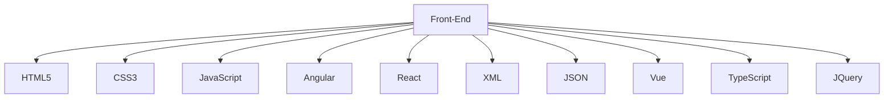
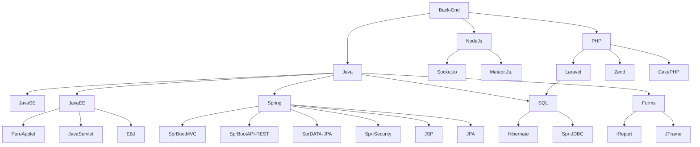

 
 

 <!-------------------------------------------------------------------------------------------------------------------------------------------->
# ¡Bienvenido!
Soy un estudiante entusiasta de Informática en busca de oportunidades para crecimiento profesional y aprendizaje. Apasionado por la resolución de problemas y la programación, he adquirido habilidades sólidas en el desarrollo de software y el análisis de datos a lo largo de mi educación. Mi enfoque curioso y orientado a resultados me impulsa a explorar nuevas tecnologías y afrontar desafíos de manera proactiva.

A medida que avanzo en mi carrera académica, busco experiencias que me permitan aplicar y ampliar mis conocimientos en un entorno del mundo real. Activo en proyectos académicos y extracurriculares, he desarrollado habilidades de colaboración y trabajo en equipo. Estoy abierto a oportunidades de pasantías o proyectos donde pueda contribuir y aprender de profesionales experimentados.

Con una mentalidad de aprendizaje continuo, estoy emocionado por las posibilidades que la informática ofrece y ansío conectar con profesionales del campo para intercambiar ideas y conocimientos. ¡Hagamos crecer nuestra red y exploremos juntos el fascinante mundo de la tecnología.


 [](https://github.com/ashutosh00710/github-readme-activity-graph)

 <!-------------------------------------------------------------------------------------------------------------------------------------------->

 <div align="center">  
   
  
  
</div> 

<!-------------------------------------------------------------------------------------------------------------------------------------------->

<p align="center">
 

<!-------------------------------------------------------------------------------------------------------------------------------------------->

<div align="center">
<div align="center">
<a href="https://www.facebook.com/victelmerzier10?mibextid=ZbWKwL="_blank"></a>
<a href="https://x.com/Victelmerzier="_blank"></a>  
<a href="https://www.youtube.com/👽" target="_blank"></a> 
<a href="https://www.tiktok.com/👽" target="_blank"></a>
<a href="https://www.instagram.com/victelmerzier/="_blank"> 

[](https://www.linkedin.com/in/VictelMerzier)
[](mailto:👽@gmail.com)
[](https://www.kaggle.com/👽)
[](https://medium.com/@👽)
</div>

<!-------------------------------------------------------------------------------------------------------------------------------------------->


<!-------------------------------------------------------------------------------------------------------------------------------------------->

<!-------------------------------------------------------------------------------------------------------------------------------------------->
<p align="center">
 
  

 
   
   
    
   
   
  
  
  
   
   
  
  
  
  
  
   
   
   
   
   
   
   

   
   
   
   
  
<p/>


<!-------------------------------------------------------------------------------------------------------------------------------------------->

 ```geojson
{
  "type": "FeatureCollection",
  "features": [
    {
      "type": "Feature",
      "id": 1,
      "properties": {
        "ID": 0
      },
      "geometry": {
        "type": "Polygon",
        "coordinates": [
          [
              [-72,-34.9],
              [-70.9,-34.9],
              [-70.9,-34.9],
              [-78,-34.9],
              [-78,-34.9]
          ]
        ]
      }
    }
  ]
}
 ```
<!-------------------------------------------------------------------------------------------------------------------------------------------->

<div align="center">
<br><p align="centre"><b>Visitors Count 👽 </b></p>  
<p align="center"></p> 
<br>
</div>

<!------>


<!-------->


<!-------------->

<a href="https://info.flagcounter.com/F9K9"></a>


